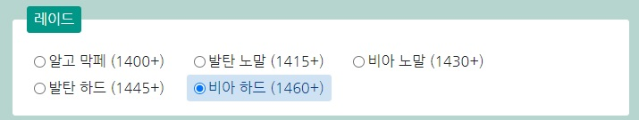
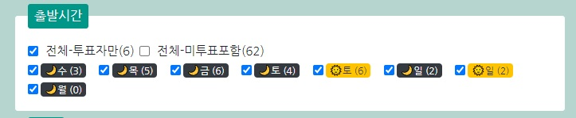
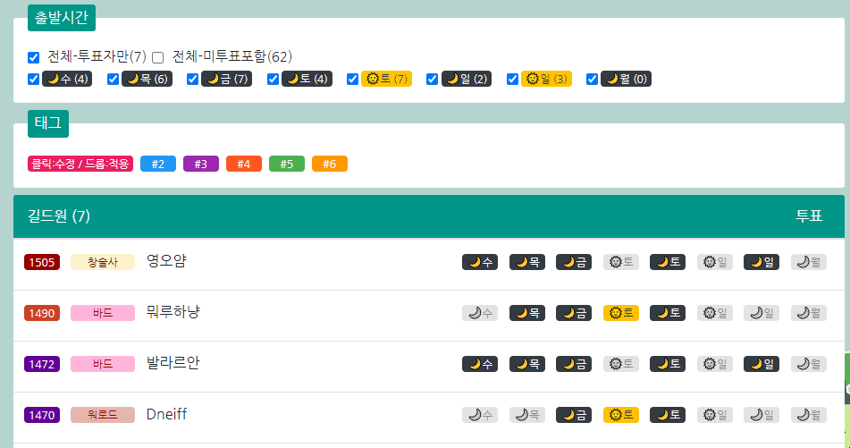
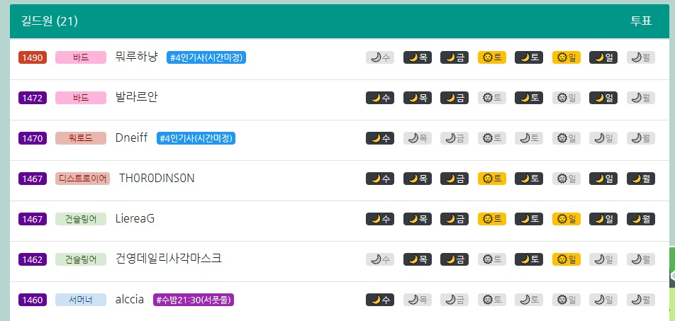
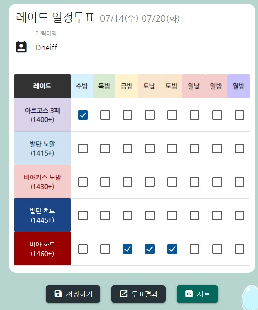

# 레이드 일정 투표

> 길드원들의 레이드 일정을 관리하기 위한 투표 사이트에 대한 소개 문서입니다.
> 투표 링크 : https://dneifiend.github.io/lostark-guild-vote
> 최근 업데이트 목록 : https://dneifiend.github.io/lostark-guild-vote/guide.html?update

## 투표 현황 페이지
길드원들의 레이드 투표 결과를 확인하고, 태그 및 레이드 참여완료 상태로 변경할 수 있는 페이지입니다. [링크](https://dneifiend.github.io/lostark-guild-vote)
#### 레이드

> 클릭 시 해당 레이드에 투표한 길드원들의 정보가 표기됩니다

#### 출발시간

> 길드원 목록에 날짜 및 투표 유무에 따른 필터를 적용하여 표기합니다.

* 전체목록 필터
  * 전체-투표자만 : 해당 레이드에 투표한 인원만 표기합니다. 이미 참가 완료한 경우 표기되지 않습니다.
  * 전체-미투표포함 : 해당 레이드에 투표하지 않은 인원과, 이미 참가 완료한 길드원도 포함하여 표기합니다.
* 요일 필터
  * 수밤~월밤 까지 해당 날짜에 투표한 인원들만 출력합니다.
  * 중복 선택이 가능합니다.
  * 화요일은 투표가 불가합니다. 
    *개발자코멘트 : 하루쯤은.. 현생을 살아주십시오.*

#### 태그

> 길드원에게 태그를 적용할 수 있습니다. 기사/승객, 특정요일시간 등 자유롭게 사용 가능합니다.

* 태그 목록
  * 드래그 & 드롭
    생성된 태그를 길드원 목록에 드롭하여 적용할 수 있습니다.
    **주의:** 해당 기능은 PC환경에서만 사용가능하며, 나머지 기능들은 PC/MOBILE 상관없이 사용 가능합니다.
  * 태그 클릭
    생성된 태그의 이름을 변경할 수 있습니다. 해당 태그를 갖고있는 모든 인원의 태그이름이 함께 변경됩니다.
* 길드원 > 태그 목록
  * 드래그 앤 드롭
    해당 태그를 다른 길드원에게 이동합니다.
  * 태그 클릭
    해당 길드원의 태그를 삭제합니다.

#### 길드원 목록

> 선택한 레이드 및 요일 필터를 적용 한 길드원 목록을 출력합니다.

* 아이템 레벨
  * 길드원의 아이템 레벨이 출력됩니다. 컨텐츠단위(15레벨) 별 색상이 구분됩니다.
* 클래스
  * 해당 길드원의 클래스를 표기합니다. 뿌리직업 별로 색상을 구분하되, 서포터는 분홍색으로 표기됩니다.
* 캐릭터명
  * 인게임 캐릭터명이 표기됩니다.
  * **클릭 시 해당 캐릭터의 투표 페이지로 이동할 수 있습니다.**
* 투표 요일
  * 길드원이 투표한 요일을 알려줍니다.
    * 🌙검은색 : 밤 투표
    * 🌞노란색 : 낮 투표
    * 회색 : 투표하지 않음
* 이미 투표한 길드원은 투표 유무와 상관없이 모든 칸이 회색으로 표기됩니다.

#### 참가 완료

> 레이드 클리어 한 인원을 선택하여 '참가완료' 상태로 변경할 수 있습니다.

가능하다면 다른 길드원이 햇갈리지 않도록 레이드 완료 시 꼭 참가완료로 변경해 주세요.

---

## 투표하기 페이지

> 레이드 투표를 위한 페이지입니다. 참여를 희망하는 요일에 체크하여 '저장하기' 버튼으로 투표를 반영할 수 있습니다. [링크](https://dneifiend.github.io/lostark-guild-vote/?AKfycbwOyCZMCZtaeo6Xy-ytjm7iOQvnX3y3WaNt-lYWhWkzMRigl4_uqeL33zwXM9mVS8haRA/exec)

* 캐릭터명 입력창
  * 자신의 캐릭터명을 입력하여 선택(클릭/화살표로선택후엔터 등) 시 해당 캐릭터의 투표가 가능합니다.
* 체크박스
  * 각 레이드 별 참여를 희망하는 시간대에 투표가 가능합니다.
  * 이미 참가한 레이드는 체크박스가 회색으로 비활성화되며, 변경이 불가합니다.
* 하단 메뉴
  * 저장하기 : 투표 결과를 저장합니다. 저장하기를 눌러야만 결과가 반영됩니다.
    저장 후 다음 투표 페이지 접속 시 자동으로 기존 기존 투표한 캐릭터를 불러옵니다.
  * 투표결과 : 투표결과 페이지로 이동합니다.
  * 시트 : 기존 사용하던 구글 스프레드시트로 이동합니다. 정리된 표로 투표 현황을 확인할 수 있습니다.