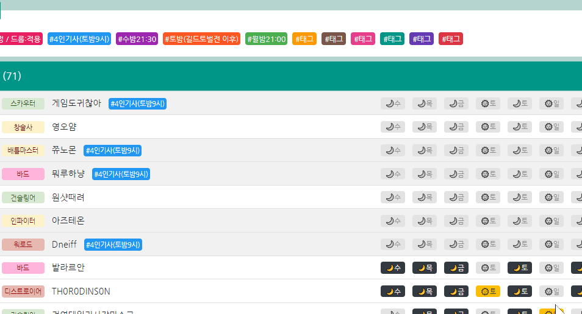

## 2021년 7월 22일 업데이트 사항 (GSVer:130)
### 투표 페이지
* 참가완료 해제 가능
  * 이제 참가완료 상태인 레이드이름을 터치하여 참가완료 상태를 미투표 상태로 변경할 수 있습니다.
  * 가이드 문서 내 관련 설명을 추가하였습니다.

---

기존 업데이트 내역

## 2021년 7월 21일 업데이트 사항 (GSVer:122)
### 공통
* 최초 접속 시 로딩 화면 추가
* 투표 저장 / 태그 적용 시 알림음 추가

### 투표 페이지
* 레이드명 클릭하여 해당 체크박스들 한 번에 변경 가능

## 2021년 7월 18일 업데이트 사항 (GSVer:107)

* 투표결과 페이지 > 유저 개별 태그 추가
  * 이제 유저 클릭 후 태그를 적용할 수 있습니다.
    해당 기능은 **모바일 환경에서도 사용 가능합니다.**
  * 사용 방법
    유저 클릭 > 적용하고 싶은 태그 목록 클릭 > 적용
  
* 투표 결과 페이지 > 필터 변경
 * 투표완료 : 수-월 중 투표한 인원 포함
 * 미투표 : 아무곳에도 투표하지 않은 인원
 * 참여완료 : 참여완료 상태인 유저 포함
 * 저레벨 : 선택한 레이드의 입장제한레밀 미만인 유저 포함
* 참가완료 유저 뚜렷하게 표기
  * 이제 참가완료 상태인 유저는 조금 더 짙은 회색에 🏴 아이콘이 표기됩니다.
* 구글 서비스가 불안정한 상황에서 일부 투표한 인원의 데이터가 소실되는 문제를 개선하였습니다.
  * 일부 투표 인원들의 데이터가 금일 13:12 기준 데이터로 롤백되었으니 아직 잔여레이드가 남은분들은 확인 후 재투표 부탁드립니다.

## 2021년 7월 16일 업데이트 사항 (GSVer:101)
* **수정사항**
  * **태그 시스템 변경 서버 로직 개선**
    이제 여러 유저가 동시에 태그를 수정하여도 별도로 수정사항이 적용됩니다.
    단, 동일레이드+동일길드원+동일태그 의 모든 조합이 동일할 경우 마지막으로 수정한 사람의 데이터가 반영됩니다.
  * **태그 갯수 증가**
  최근 신규 길드원 및 부캐릭터 등의 사유로 길드원이 증가함에 따라 기존 6개 태그로는 부족함이 발생한다고 판단하였습니다.
  이에 태그 갯수를 11개로 증가하였으며, 부족하다는 판단이 드는 시점에 다시 추가할 예정입니다.
  * **투표 페이지 캐릭터명 입력 중 기존 투표결과 제거**
  캐릭터를 연속으로 조회하여 수정하는 경우 혼동을 방지하기위해 캐릭터명 입력 시 기존 투표결과를 숨김처리합니다.
  * **서버통신 중 마우스 커서 변경**
  서버와 통신이 진행되어 데이터 저장/조회가 이루어지는 중에 마우스 커서가 진행중 상태로 변경됩니다.
* **버그 수정**
  * css, 서버로직, 자동갱신처리, null값 등 10건 이상의 버그 수정

## 2021년 7월 15일 업데이트 사항 (GSVer:97)
* 수정사항
  * 길드원목록 / 태그적용길드원목록 정렬기준 수정
    Ilv > 클래스(바홀)
  * PC화면에서 길드원 목록의 여백/글자크기를 조정하여 한 화면에 조금 더 많은 길드원 목록이 표기됩니다.
* 버그픽스
  * 길드원 목록 링크 미작동 오류 수정
  * 태그 길드원 목록 미투표 인원을 비활성화가 아닌 미참여 상태로 수정
  * 태그 길드원 목록 참가완료 아닌 미투표 인원 선택 가능하도록 수정
  * 구글 서비스 원활하지 않을 경우 길드갱신 중단
## 2021년 7월 14일 업데이트 사항 (GSVer:83)
* 수정사항
  * 태그 보유 길드원 목록 템레벨/직업 포함 리스트 표기
    길드원을 선택하여 참가완료로 변경도 가능합니다.
* 버그픽스
  * 태그이름 변경 시 인풋필드 기본값 미갱신 오류 수정

## 2021년 7월 13일 업데이트 사항 (GSVer:72)

* 투표 URL 변경
  * https://dneifiend.github.io/lostark-guild-vote/
  * 구글 스크립트 웹앱 + 깃허브 페이지 방식으로 변경되었습니다.
    > [개발자코멘트] 이로써 상단의 구글 경고 (이 앱은 구글이 만든게 아닙니다) 경고가 제거되었습니다.
  * 기본 페이지는 투표결과 페이지로 수정하였습니다.
    > [개발자코멘트] 투표 전 다른 길드원들의 투표 추세를 확인한 후 투표하는것을 권장합니다.
* 투표 캐릭터 자동 선택
  * 투표한 경우 다음 투표페이지 접속 시 동일한 캐릭터가 자동으로 선택됩니다.
* 기타 수정사항
  * 참가완료로 변경 시 선택한 캐릭터들의 목록이 표기됩니다.
  * 출발시간/태그/길드원명 등 클릭 시 별도 메뉴가 생성되는 경우 마우스포인터 변경됩니다.
  * 태그명 팝업 내 입력창에 변경 전 태그명이 기본값으로 설정됩니다.

## 버그픽스
* character 파라미터가 길드원 목록과 일치하지 않는 경우 무한로딩 오류 수정
* 투표요일 추가(수밤/월밤)에 따른 레이드 투표일정 표기 로직 변경

